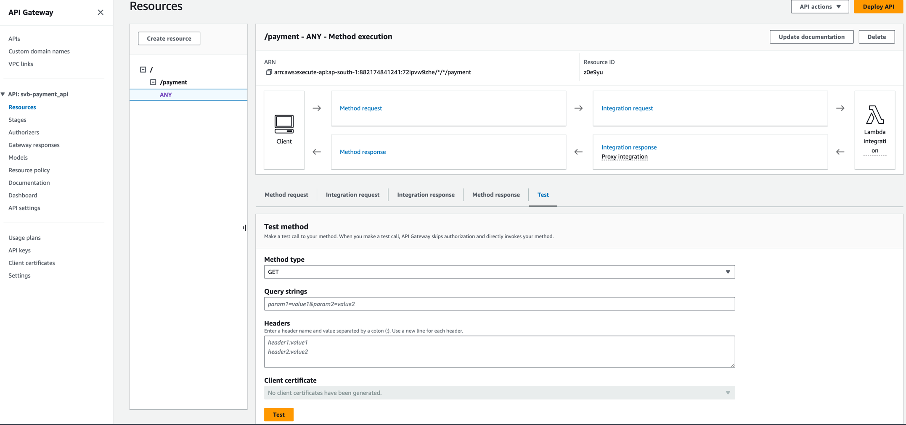

## Terraform Project for EC2 within Custom VPC

### Setup & Install

### Commands:
$ terraform init

$ terraform validate

$ terraform fmt

$ terraform plan -var-file="./dev/terraform.tfvars"

$ terraform apply -var-file="./dev/terraform.tfvars"

$ terraform destroy -var-file="./dev/terraform.tfvars"

### Create Lambda Function
$ cd lambda_functions/
$ zip -r function.zip lambda_function_helloworld.py dependencies/

### Create API Gateway and Lambda integration
Refer compute.tf

### Test

